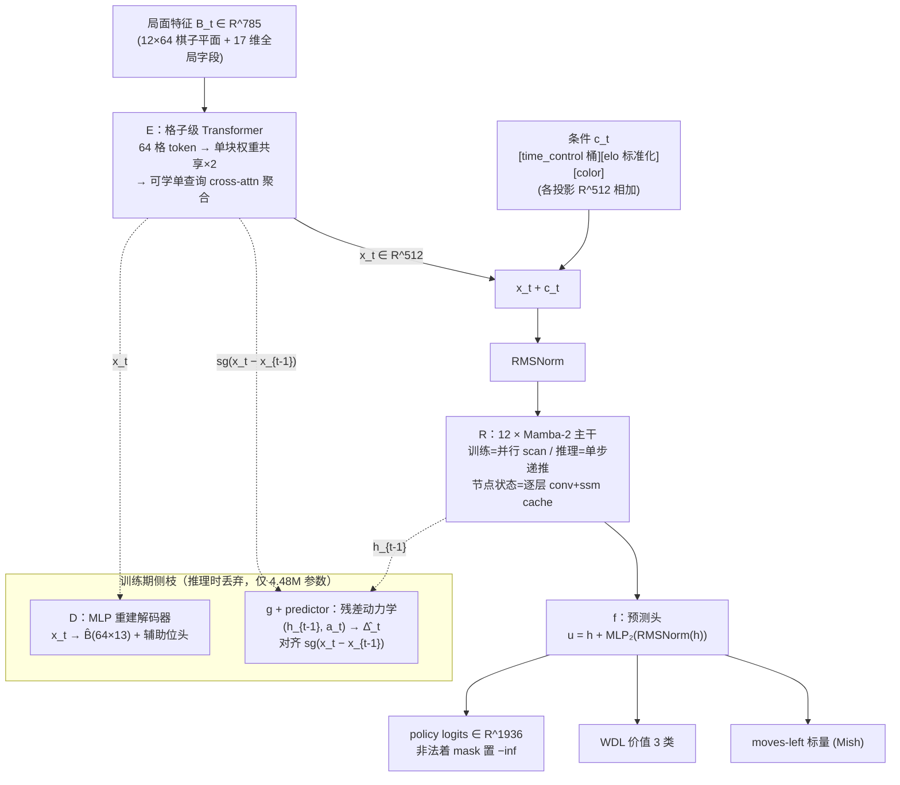
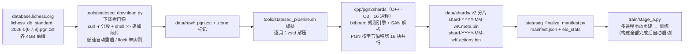
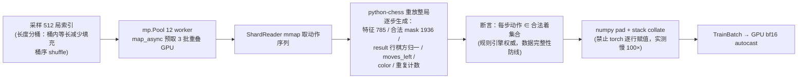
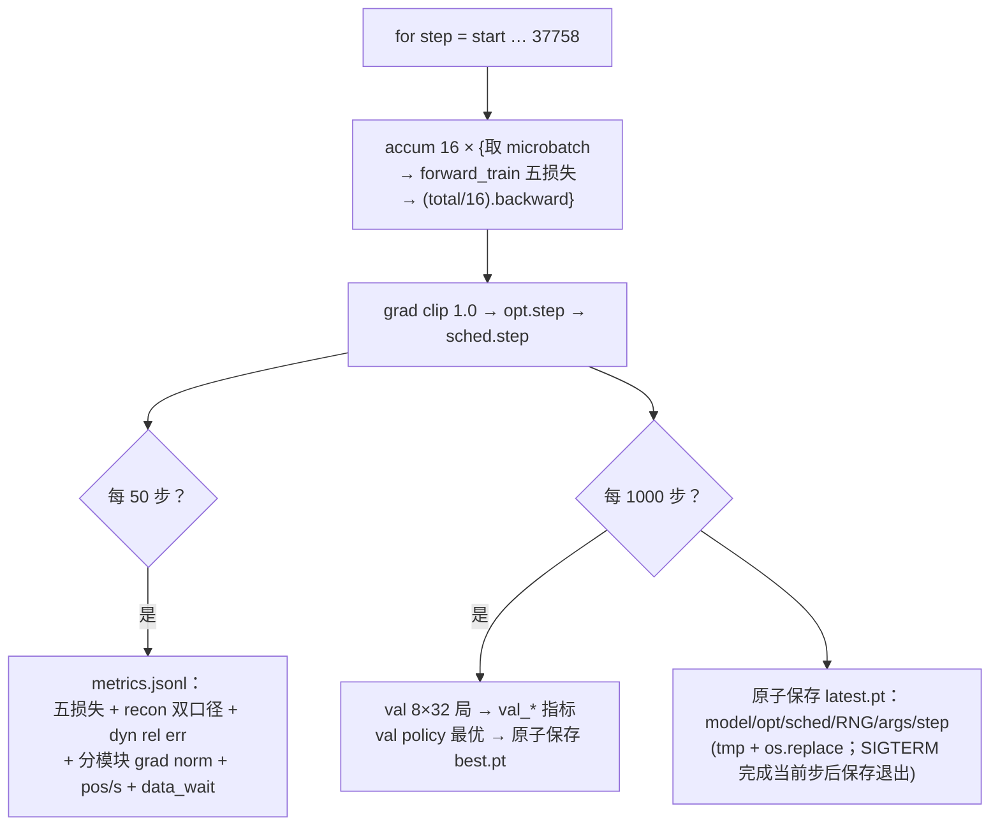
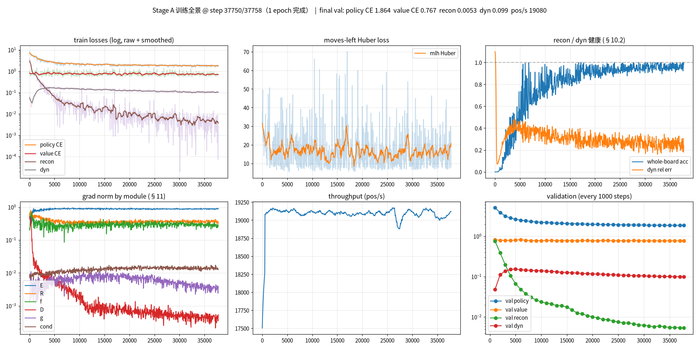
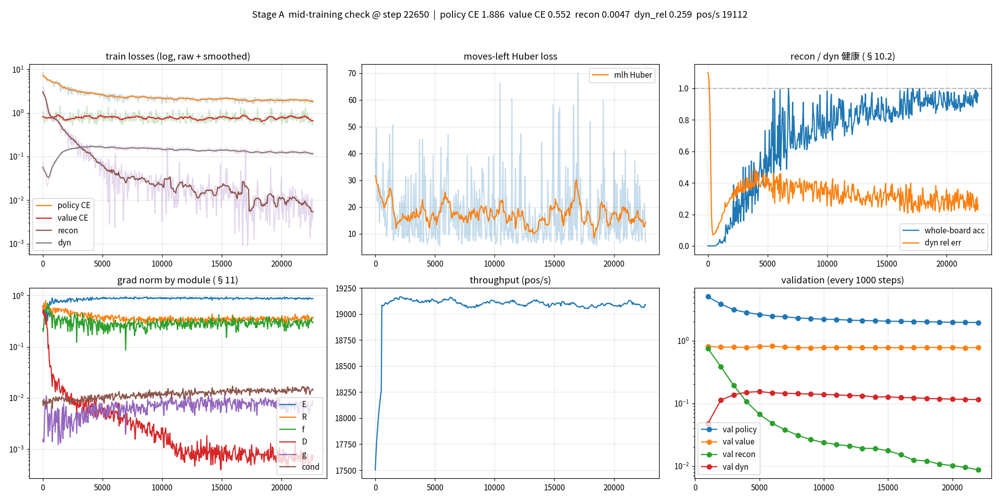

# Stage A 实验报告 · 状态序列模型人类棋谱预训练

> 本文档供**外部审查**使用，覆盖实验管线、模型、数据、损失、训练配置、验收与当前进展的全部实现细节。
> 权威设计文档：`state-sequence-model-design.md`（v2.0，已从旧目录迁入本文档同目录，D1–D10 已锁定）；
> 实现偏差见 [design-deviations.md](design-deviations.md)；本文一切口径以代码为准。

## 0. 摘要与当前状态

| 项 | 值 |
|---|---|
| 实验 | Stage A · 人类棋谱行为克隆（BC）预热训练 |
| 模型 | 状态序列模型 E(格子级 Transformer) → R(12 层 Mamba-2) → f(policy/WDL/moves-left 三头)，训练期侧枝 D(重建)/g(残差动力学) |
| 参数量 | **26.40M**（预算 ~28M，D4） |
| 数据 | Lichess 2026-06/07/08 三个月 standard 棋谱，各取 4GB 前缀；**19,332,026 训练局 / 97,123 val 局 / 13.05 亿 ply** |
| 训练量 | **1 epoch = 37,758 步**（每局恰好过一遍） |
| 进度（本文撰写时） | step ~22,650 / 37,758（60%），预计 2026-09-16 早完成 |
| 阶段 0 验收 | §10.1 七项门槛 **17/17 全过**（含冒烟门禁持续监控） |
| 当前关键指标 | train policy CE 1.89（val 1.96 @22k 且仍下降）、value CE 0.55、recon CE 0.005、dyn rel err 0.26–0.31（红线 1.0 内） |

**一句话定位**：用 19M 局真实人类对局训练一个"逐节点递推、状态即 RNN 隐状态"的棋类序列模型，作为后续自对弈 RL（Stage B）的初始化与 MCTS 递推引擎；**明确不用 Stockfish 蒸馏**。

---

## 1. 实验目标与阶段定位（设计文档 §8）

- **Stage A（本文）**：人类棋谱 BC 预训练，目标是学到可用的先验策略/价值与稳定的递推表示，而非最终棋力。
- Stage B（后续）：接入自对弈 RL；Stage C/D：按观察到的瓶颈再加功能。
- Stage A 出口含与旧 46M champion 模型同口径的对弈 arena 评测，但**无硬性棋力承诺**。

---

## 2. 模型架构

### 2.1 总体逻辑图



**推理路径**（未来 MCTS 节点扩展）只有实线部分：每到一个新节点，E 编码当前局面一次，R 用 `step()` 递推一格，f 出三头输出；节点状态 = R 的逐层 cache（copy-on-write 分支隔离，§9）。

### 2.2 局面特征 B_t：785 维无损编码（§3.2 / D5）

白方绝对坐标，不随走子方翻转；float32，布局固定，可由特征完整恢复 FEN：

| 区间 | 维度 | 内容 |
|---|---|---|
| [0, 768) | 12×64 | 棋子平面（二值）：白 P N B R Q K = 0..5，黑 = 6..11；格序 a1=0 … h8=63 |
| [768] | 1 | 走子方（白=1 黑=0） |
| [769, 773) | 4 | 易位权：白王翼/白后翼/黑王翼/黑后翼 |
| [773, 781) | 8 | 过路兵 file one-hot（仅当存在合法吃过路兵，否则全零） |
| [781] | 1 | 半回合计数 /100（截断 100） |
| [782] | 1 | 全回合数 /200（截断到 1） |
| [783, 785) | 2 | 重复计数参考位（此前出现 1 次 / ≥2 次；判定权威在规则引擎，本特征不作判定依据） |

即 $B_t \in \{0,1\}^{768} \times [0,1]^{17} \subset \mathbb{R}^{785}$。文档称"约 790"，实现为 785（已记入偏差表）。

### 2.3 动作空间：1936 维紧凑编码（§3.3 / D10）

$$\mathcal{A} = \underbrace{1456}_{\text{后可达 }(from,to)\text{ 有序对}} + \underbrace{336}_{\text{马跳}} + \underbrace{144}_{\text{升变}} = 1936$$

- 非升变走后/马走法集合；**王车易位天然落在"王两格横移"的后走法对中**（如 e1→g1），无需特判。
- 升变 = 兵到末排 16 个 from 格 × 3 名义方向 × {R, B, N} = 144（升后已含于后走法；用自环占位保证 id 连续）。
- id 编排写死（后走法 from 升序→8 方向固定序→距离升序；马 1456..1791；升变 1792..1935），构建时断言计数；`move ↔ action id` 双射有单测（验收 #1）。

### 2.4 条件输入 c_t（§3.4 / D2）

$$c_t = \mathrm{emb}_{tc}(b^{tc}) + W_e\,\hat e + \mathrm{emb}_{color}(j_t) \in \mathbb{R}^{512}$$

- **time_control**：7 桶 embedding（bullet <180s / blitz <480s / rapid <1500s / classical / correspondence / other / unknown），有效秒数 = 基础秒 + 40×加秒。
- **elo**：双方平均 Elo，按训练集 P1/P99 截断后标准化（$\hat e = (e-\mu)/\sigma$）再线性投影；缺失时走 unknown 桶、elo_std=0。
- **color**：行棋方 2 类 embedding。**逐步取值**（曾修 bug：全程用首步值会污染黑方所有步的条件，被整序列 vs 逐步 diff=2.22 抓出）。
- 推理时置最大 Elo 桶求最强风格、置目标分段得人类化风格（D2 既定用途）。

### 2.5 模块定义与公式

**E — 格子级 Transformer（d_e=256，§5.2）**，每节点一次、不看历史：

$$s_i = \mathrm{emb}_{piece}(c_i) + \mathrm{emb}_{pos}(i) + W_g\,g_t,\quad i = 1..64$$
$$S \leftarrow \mathrm{Block}(\mathrm{Block}(S)) \quad(\text{同一块权重走两遍，} K{=}1)$$
$$x_t = \mathrm{RMSNorm}\Big(W_{proj}\,\mathrm{RMSNorm}\big(q + \mathrm{softmax}(\tfrac{qK^{\top}}{\sqrt{256}})V\big)\Big) \in \mathbb{R}^{512}$$

Block 为 Pre-RMSNorm 残差（MHA 8 头 + MLP 4×，GELU，dropout 0.1）；聚合用**可学单查询** q 对 64 格做 cross-attention。

**R — 12 层 Mamba-2 主干（§5.3）**，块级残差 $h \leftarrow h + \mathrm{Mamba2}_l(\mathrm{RMSNorm}(h))$：

| 配置 | 值 |
|---|---|
| d_model / expand（d_inner） | 512 / 2（1024） |
| d_state / d_conv / headdim | 16 / 4 / 64 |
| 层数 | 12 |
| 数值口径 | 并行 scan kernel 内部保持 fp32；训练 bf16 autocast |

两种消费方式：训练走整序列并行 scan（$T \le 200$，不用 TBPTT）；推理走 `step()` 单步递推，节点状态为逐层 `(conv_state, ssm_state)` cache。官方 `Mamba2.step` 会**原地改写**传入 cache，实现内先克隆再调用（copy-on-write，验收 #4）。

**f — 预测头（§5.4）**：

$$u_t = h_t + \mathrm{MLP}_2(\mathrm{RMSNorm}(h_t))$$
$$z^p_t = W_p u_t,\qquad p(a \mid s_t) = \mathrm{softmax}\big(z^p_t + M_t\big) \quad (M_t\text{ 非法着} = -\infty)$$
$$(W,D,L)_t = \mathrm{softmax}\big(W_v\,\mathrm{RMSNorm}(u_t)\big),\qquad \hat m_t = \mathrm{Mish}\big(w_m^{\top}\mathrm{RMSNorm}(u_t)\big)$$

$\hat m_t$ 为剩余 ply 数标量预测（Mish：$x\tanh(\mathrm{softplus}(x))$，负输入可产生小负值——**不恒正**，若未来用它做时间管理不能假定输出非负）。

**D — MLP 重建解码器（仅训练，§5.5）**：

$$\hat B_t = \mathrm{reshape}\Big(W_2\,\mathrm{GELU}\big(W_1\,\mathrm{RMSNorm}(x_t)\big),\ 64 \times 13\Big)$$

13 类 = 12 棋子平面 + 空格；另有 3 个辅助位头（走子方 2 类 / 易位权 4 路独立 sigmoid / 半回合计数 16 桶）。定位：**辅助监督与诊断工具**，不是可逆性证书，不作为进入 RL 的门槛。

**g + predictor — 残差动力学侧枝（仅训练，§5.6）**：

$$z_t = \big[\,\mathrm{RMSNorm}(h_{t-1})\ ;\ \mathrm{emb}_a(a_t)\,\big] \in \mathbb{R}^{1024},\qquad \hat\Delta_t = P\Big(W_2\,\mathrm{GELU}\big(z_t + \mathrm{GELU}(W_1 z_t)\big)\Big)$$

$P$ 为 512→512 两层 MLP；$t=0$ 时 $h_{-1} := h_{init}$（可学向量），且 t=0 不入 $L_{dyn}$。定位：**表示塑形**（§7.1，原因侧收梯度、答案侧 stop-gradient 保护），非精确世界模型——R 不记棋盘（§5.3 设计使然），g 输入存在结构性信息缺口，规则引擎即完美动力学（附录 A.2）。

### 2.6 参数量（代码实测，对照 §5.7 预算 ~28M）

| 模块 | 参数量 | 说明 |
|---|---|---|
| cond | 0.01M | 3 个条件嵌入/投影 |
| E | 1.14M | 单块 Trm×2 + 聚合 + 投影 |
| **R** | **19.25M** | 12 × Mamba2（主干，占 73%） |
| f | 1.52M | 共享变换 + 三头 |
| D | 1.39M | 仅训练 |
| g+predictor | 3.09M | 仅训练；其中动作嵌入表 1936×512 ≈ 0.99M |
| **合计** | **26.40M** | 推理实际携带 = 21.92M（E+R+f+cond） |

---

## 3. 损失函数（§6，归一化口径统一）

每步 $t$：$\pi_t$ = 人类实际走子（Stage A = one-hot 目标），$y_t$ = 对局结果对**行棋方**归一（胜 0 / 和 1 / 负 2），$e$ = 双方平均 Elo，$d=512$。全部损失支持填充掩码 `pos_mask`（长度分桶 padding 不贡献梯度）。

| 损失 | 公式 | 权重 |
|---|---|---|
| policy | $\displaystyle L_{pol} = \frac{\sum_t w(e)\,\mathrm{CE}\big(\pi_t,\ p(\cdot\mid s_t)\big)}{\sum_t w(e)}$ | $w_p = 1.0$ |
| value | $\displaystyle L_{val} = \mathrm{mean}_t\ \mathrm{CE}\big((W,D,L)_t,\ y_t\big)$ | $w_v = 0.8$ |
| moves-left | $\displaystyle L_{mlh} = \mathrm{mean}_t\ \mathrm{Huber}_{\delta=1}\big(\hat m_t - m_t\big)$（ply 计，截断 200） | $w_m = 0.1$ |
| recon | $\displaystyle L_{rec} = \mathrm{mean}_{t,sq}\ \mathrm{CE}\big(\hat B_t[sq], B_t[sq]\big) + 0.3\,L_{aux}$ | $w_r$: 1.0→0.1 退火 |
| dynamics | $\displaystyle L_{dyn} = \mathrm{mean}_t\ \tfrac{1}{d}\big\lVert \hat\Delta_t - \mathrm{sg}(x_t - x_{t-1}) \big\rVert^2$ | $w_d = 0.5$ |

总损失：

$$L = w_p L_{pol} + w_v L_{val} + w_m L_{mlh} + w_r(s)\,L_{rec} + w_d L_{dyn},\qquad w_r(s) = 1.0 + (0.1 - 1.0)\cdot\min\Big(\frac{s}{0.3\,S},\ 1\Big)$$

$w_r$ 在前 30% 步线性退火（终点 step 11,327，已过）；$L_{dyn}$ 的 target 与残差基线**双侧 stop-gradient**（§7.1 答案侧保护：detach 只切断 Δ 的两个端点，g 的输入 $h_{t-1}$ 未 detach——**梯度沿 g→h→R→E 回传，g 参与主干表示塑形**）。

**Elo 加权（D9，线性，损失级而非采样级）**——所有局被看的概率相同，权重只改变 policy 损失归一：

$$w(e) = \mathrm{clip}\Big(\frac{e - e_{min}}{e_{max} - e_{min}}(r - 1) + 1,\ 1,\ r\Big),\quad r = 20,\quad e_{min}=774.5,\ e_{max}=2567.5\ (\text{训练集 P1/P99})$$

即最强分段棋的 policy 误差权重是最低分段的 20 倍；全 Elo 分段保留在训练中（D9）。初值/校准条款（§6）：上线前按前 1000 步各分量对共享主干的梯度范数校准——实测 D 模块 grad norm ~$10^{-3}$（主干 ~$10^{-1}$），无需调整。

**四指标分工**（供审查者判断"该看哪个"）：policy/value 是主目标；mlh 辅助（权重 0.1）；recon CE + whole-board acc + dyn rel err 是**防坍缩体检**（§7.2，无硬优化目标）；val 集防背题并负责选 best.pt。

---

## 4. 数据管线（§4）

### 4.1 源数据

- **来源**：Lichess 官方月度数据库 `database.lichess.org`，**standard 时限** PGN（.pgn.zst），月份 **2026-06 / 2026-07 / 2026-08**，各取压缩流前 **4GB**（用户批准的 3×4GB 方案，平衡下载带宽与数据量）。
- **规模**：合计 **19,332,026 训练局 + 97,123 val 局 = 19,429,149 局**，共 **13.05 亿 ply**，分片常驻内存仅 **~2.8GB**（存动作序列而非局面，局面在训练时重放重建）。
- **Elo 统计**（双方平均 Elo，构建期统计）：min 774.5 / max 2567.5 / mean 1656.1 / std 390.9（P1/P99 截断口径，与标准化器、加权公式同源）。

### 4.2 实验管线总流程



设计要点：

- **下载看门狗**：lichess 对远端 IP 管道限速波动大（100KB/s–12MB/s），看门狗负责分段续传（`curl -r A-B` 配合 shell `>>` 追加——`curl -o` 重启会截断重写丢字节）、低速超时重启、`flock` 保证单实例。
- **C++ 构建器**（`cpp/pgn2shards.cpp`，用户要求替换 CPU 利用率低的 Python 构建）：自含完整规则引擎（bitboard 走子生成、王安全、SAN 解析、王车易位、吃过路兵、升变 R/B/N/Q），PGN 文本按字节偏移切 16 块（块边界对齐 `[Event `），每块一进程。**性能：12.5 万局 1.08s，比 python-chess 构建快 ~100 倍**，三个月数据 6 分钟构建完。
- **三重正确性校验**：① `--selfcheck` perft(4) 必须精确 = 197,281；② 与 Python 构建器在 125,066 局上**逐字节对拍一致**；③ 动作表 `--dump-actions` 逐字节一致；另有训练曲线健康作旁证。开发中修过的引擎 bug 全部有回归防护（王滑动漏对角、射线攻击同色子、升变缺 Q、NAG 后缀未剥离等，见 git 历史）。

### 4.3 v2 分片格式（每局 ~150B，变长记录）

| 文件 | 布局 |
|---|---|
| `*.meta.bin` | 16B/局固定记录：u16 n_plies / u8 tc_bucket / u8 result / u8 elo_missing / u8 pad / f32 elo_mean / u32 local_idx / u32 pad |
| `*.actions.bin` | uint16 动作 id 池（每局 n_plies 个，顺序即着法序列） |

原子写入（临时文件 + `os.replace`）；读取侧 mmap + 预存 offsets，随机取局 O(1)。

### 4.4 训练时重放（存动作、不存局面）



- 单 worker 重放 ~16.6k 步/s（python-chess 合法着生成为主），12 worker + 预取使 data_wait ~50ms，GPU 利用率 77–95%。
- 序列截断 $T_{max} = 200$ ply（§7.3）；整序列训练不用 TBPTT。

### 4.5 train/val 划分

按局哈希：$\mathrm{splitmix64}\big(\mathrm{crc32}(month) \oplus worker \oplus local\_idx\big)$，hash % 100000 < 500 → val（**0.5%**，97,123 局）。同局绝不跨集；val 固定抽样种子 777，每 1000 步评 8×32 局，仅用于监控与 best.pt 选择，不回传梯度。

---

## 5. 训练配置（§7.3 锁定超参）

| 项 | 值 |
|---|---|
| 优化器 | AdamW，β = (0.9, 0.999)，weight decay 0.1，fused |
| 学习率 | 1e-4 → 1e-5 cosine，**warmup 4,000 步**线性 |
| LR 公式 | warmup：$\eta_s = \eta_{max}\frac{s+1}{4000}$；其后 $\eta(t) = \eta_{min} + \frac{\eta_{max}-\eta_{min}}{2}\big(1+\cos(\pi t)\big)$，$t=\frac{s-4000}{S-4000}$ |
| 有效 batch | **512 局 = microbatch 32 × grad accum 16**（microbatch 由 5070 Ti 显存实测，不照搬论文） |
| 精度 | bf16 autocast（Mamba scan 内部 fp32，官方 kernel 默认） |
| 正则 | dropout 0.1；grad clip 1.0 |
| epoch | 1（37,758 步 = ⌈19,332,026 / 512⌉，每局恰好一遍） |
| 吞吐 | ~19.1k pos/s；GPU 显存 ~14GB / 16GB |

---

## 6. 训练循环与检查点纪律



恢复：`--resume` 从 latest.pt 完整恢复（含 CPU/GPU RNG 状态，数据顺序可复现），并断言 microbatch/accum 与检查点一致。

---

## 7. 阶段 0 验收结果（§10.1，进 Stage A 的门槛，17/17 全过）

| # | 验收项 | 结果 |
|---|---|---|
| 1 | 动作空间双射（move ↔ id，含易位/过路兵/全部升变） | ✅ |
| 2 | 785 维特征编码/解码往返 | ✅ |
| 3 | 整序列 vs 逐步递推一致性 | ✅ 方案 A：policy **softmax 概率差** <1e-4（实测 1.3e-6）；raw logits 差 ~2e-4 为 mamba kernel 固有数值噪声，作诊断记录（作者确认，见偏差表 #1） |
| 4 | 推理 cache 分支隔离（copy-on-write） | ✅ |
| 5 | 合法 mask（非法着 −inf） | ✅ |
| 6 | 单 batch 过拟合（loss 33.4→18.3 无 NaN） | ✅ |
| 7 | 价值符号 / moves-left 口径 | ✅ |

另：500 步试点训练健康（loss/grad norm 正常）后才启动正式训练；冒烟门禁 §10.2（dyn rel err < 1、嵌入方差非零、Δ̂ 随动作变化）随训练持续监控。

---

## 8. 训练现状与曲线

**已完成（2026-09-16 05:34 TRAIN_DONE，37,758/37,758 步 = 1 epoch 全部跑完）**。最终验证指标（@37,758）：policy CE **1.864** / value CE 0.767 / recon CE 0.0053（全盘 acc 95.7%）/ dyn mse 0.099 / mlh 18.1。



### 训练中期快照（step ~22,650，2026-09-15 晚）



*六面板：① 五损失（log，raw+平滑）② moves-left Huber ③ 防坍缩体检（whole-board acc 蓝 / dyn rel err 橙，红虚线 = 1.0 红线）④ 分模块 grad norm（§11）⑤ 吞吐 ~19.1k pos/s ⑥ val 汇总（每 1000 步）。*

### 关键数值

| 指标 | train @22,550 | val @22,000 | 解读 |
|---|---|---|---|
| policy CE | 1.89–2.02（波动） | **1.960 且仍单调下降**（20k: 1.978 → 21k: 1.969 → 22k: 1.960） | 主目标健康，无背题迹象 |
| value CE | 0.55–0.77 | 0.781 | 三分类对局结果，信息量上限低，正常区间 |
| moves-left Huber | 15–25（高方差） | 18.6 | 权重 0.1 辅助任务，残差本质高方差，暂观察 |
| recon CE | 0.0053 | 0.0087 | E 表示保留局面信息，很好 |
| whole-board acc | 90.8% | 92.4% | 曾爬至 ~100% 后退火回落波动（预期：w_r 退火后 D 变轻） |
| dyn rel err | 0.26–0.31 | 0.49 | **远在 1.0 红线内**；中段升至 0.4–0.9 是任务变难（E 表示分化使 ‖Δ‖ 变大）非拟合能力不够 |
| grad norm | E ~0.9 / R ~0.4 / f ~0.3 / D ~8e-4 / g ~7e-3 | — | 全部平稳无突增（§11 告警线 = 10× 中位数） |
| 吞吐 | 19.0k pos/s，data_wait ~50ms | — | 数据管线充足 |

**曲线时间线**：policy CE 8.3（初始化）→ 2.03（step 500 试点）→ 1.86（step 12k）→ 现 ~1.9 波动下降（val 持续降）；recon 4.07 → 0.0086；dyn rel err 开局 0.1 → 中段 0.4–0.9 → 现 0.28。

**dyn rel err 上升机理**（审查者最可能问的"反直觉"指标）：$L_{dyn}$ 要求从 $(h_{t-1}, a_t)$ 预测 E 表示差 $x_t - x_{t-1}$，而 R 的隐状态按设计不记棋盘（§5.3），g 拿不到被吃棋子位置等局面信息——存在结构性信息缺口，精确预测既不可能也不必要；g 的定位是表示塑形（§7.1）。注意：相对误差 $r=L_{dyn}/\text{delta\_energy}$ 在分子固定时分母增大只会**降低**比值——记录口径 r 的波动须结合分子（mse）与批内 padding 构成解释，不能用"分母变大"单独解释；红线 1.0 来自 §10.2 冒烟门禁。

---

## 9. 训练完成诊断（2026-09-16，tools/stateseq_diag.py 离线评估，runs/stage_a_20260915/diag_37000.md）

在固定验证子集（seed 777、256 局、16,936 局面，与训练时验证同口径）+ 2,048 局训练子集上：

**Value**：WDL 先验 CE 0.833 → 模型 CE 0.766（同一 checkpoint、同一 256 局子集、同一掩码口径），**value_gain = 0.067 nats**（降幅 8%）——超过常数基线但信号弱，性质是"单局 WDL 标签信噪比低"而非实现问题（和棋率 3.85% 经原始 PGN 对照确认是 Lichess 超快棋池真实分布，非解析 bug）。预测分布未塌缩（pW P95≈0.79）、校准良好（0.93 置信 bin 命中率 0.99）；3×3 表有弱区分度（胜局 pW 0.539 vs 先验 0.484）；价值信息集中在近终局（d=1–10 CE 0.606，开局 0.808、远终局 0.829 接近先验）。

**Policy**：Top-1 44.5% / Top-3 71.6%（合法着掩码后、剔除 1.0% 单合法着局面后 43.9%）；开局 50.8% > 中残局 ~41%；Elo 高档略高。

**Dyn 与 latent**：dyn mse 0.099 vs delta_energy 0.393（正确掩码口径 rel = 0.25；训练日志记录的 0.49 是未加 pos_mask 的口径偏差，见 design-deviations §3）；latent 跨局面方差 0.712±0.122/维（均匀，无死维），‖x‖₂ 恒定是 RMSNorm 的数学性质非坍缩。

**g 动作对应性（曾误判后修正）**：初版块 D 有整 ply 错位（h/x 取 t−1、后继取 B_t），噪声淹没信号；修正后 err_correct 0.097 ≈ 训练口径 dyn mse，且 74% 样本对正确配对（err_correct 0.097 < err_swapped 0.116）→ **g 确实利用动作信息**；按未训练过的自然后继口径 g(h_t,a)→x(B_a)−x_t 也有 81% 对正确，动作敏感性部分可迁移。动作间 Δ̂ 间隙 mean 0.025（跨局面散布 0.30），动作路径活跃。

**检查点**：latest.pt = step 37,000；best.pt（val policy 最优）= step 37,758，两者指标几乎一致。

> **口径声明（评审要求补记）**：① 本节全部指标来自固定 256 局验证子集（seed 777，16,936 局面），非完整 97,123 局验证集，且同局局面彼此相关、非独立样本；独立 held-out 评估（2–4k 局未参与 best 选择）待补。② 文中 0.754（sanity 前向批口径）/ 0.766（value 块掩码口径）/ 0.767（训练时验证口径）三个 value CE 分属三种口径，勿混用；value_gain 只在同口径内成立。③ 此前"4-0 胜随机走子 ⇒ 适配器无 bug"的推论不成立——该冒烟只验证合法走子，value 视角/历史缓存/条件输入均未覆盖，端到端对拍见 §10。

## 10. 监控与告警口径（§11 + §10.2）

每 50 步记录（`metrics.jsonl`）：五损失、recon 双口径（CE + whole-board acc）、dyn rel err、分模块 grad norm、pos/s、data_wait。告警规则：

1. **grad norm 突增 >10× 中位数** → 告警、回滚 latest.pt（当前各模块平稳，无触发）。
2. **防坍缩体检三条件同时成立** = 坍缩预警：dyn rel err 破 1.0 且持续 ↑ + gn_g 坍向 0 + recon 恶化。当前三者全部健康。
3. val policy 负责选 `best.pt`（按 val policy CE 最优，防背题）。

---

## 10. 已知实现偏差

全部经设计文档作者确认，记录在 [design-deviations.md](design-deviations.md)：

1. **验收 #3 口径**：kernel 并行 scan 与单步 decode 存在固有浮点噪声（raw logits diff ~2e-4），policy 断言改用 softmax 概率差 <1e-4（实测 1.3e-6）。
2. `aux.py` → `model_d.py`/`model_g.py`（`aux` 是 Windows 保留设备名）。
3. g 首层残差按同维堆叠实现 $h = z + \mathrm{GELU}(W_1 z)$（1024→1024）再 $W_2$（1024→512）。
4. 参数 26.40M（预算 ~27M）：g 超 1.6M 主因动作嵌入表 0.99M，总量仍在 D4 的 ~28M 内。
5. 特征实际 785 维（文档称"约 790"）。

---

## 11. 复现指南

```bash
# 环境：Ubuntu + conda env（Python 3.12.14，torch 2.11.0+cu128，
#        mamba-ssm 2.3.2 + causal-conv1d 1.7.0 源码编译，CUDA 12.9，TORCH_CUDA_ARCH_LIST="12.0+PTX"）
# 硬件：RTX 5070 Ti 16GB

# 1) 验收测试（17 项）
python -m unittest discover -s tests -v

# 2) C++ 构建器（含 perft 自校验）
g++ -O3 -std=c++17 -o tools/pgn2shards cpp/pgn2shards.cpp -pthread
tools/pgn2shards --selfcheck

# 3) 数据管线（下载看门狗 + 编排，构建完自动启动训练）
python tools/stateseq_download.py &          # 逐月 4GB 前缀
setsid nohup bash tools/stateseq_pipeline.sh > data/pipeline.log 2>&1 &

# 4) 训练（即本实验命令）
python train/stage_a.py --data data/shards --out runs/stage_a_20260915 \
    --microbatch 32 --accum 16 --workers 12 \
    --save-every 1000 --val-every 1000 --log-every 50

# 5) 画指标图（需 matplotlib 环境）
python tools/stateseq_plot_metrics.py --run runs/stage_a_20260915
```

代码地图：`stateseq/actions.py`（动作空间）、`features.py`（785 维特征）、`conditions.py`（条件输入）、`model_e.py`/`model_r.py`/`heads.py`（主路径）、`model_d.py`/`model_g.py`（训练侧枝）、`losses.py`（五损失）、`model.py`（总装+逐步递推接口）、`data/gshards.py`（分片读写）、`data/dataset.py`（重放+collate）、`train/stage_a.py`（训练器）、`cpp/pgn2shards.cpp`（数据构建）、`tools/`（下载/管线/绘图/探针）、`tests/`（17 项验收）。

---

## 12. 环境与框架版本

| 项 | 值 |
|---|---|
| GPU | RTX 5070 Ti 16GB（训练独占期临时停用同机生产服务） |
| OS / Python | Ubuntu（WSL 外独立主机）/ Python 3.12.14 |
| PyTorch | 2.11.0+cu128（编译 mamba 时须 pin，防 pip 升级） |
| mamba-ssm / causal-conv1d | 2.3.2 / 1.7.0（源码编译，CUDA 12.9，arch 12.0+PTX） |
| 数据依赖 | python-chess（训练期重放）、numpy、zstd |
| 关键接口事实 | `Mamba2.step()` 原地改写传入 cache → 调用方必须克隆；`Mamba2` 不接受 dropout 参数 |

*文档版本：2026-09-15，对应 run `runs/stage_a_20260915` step ~22,650。训练完成后本表 8/9 节将更新为最终指标。*
